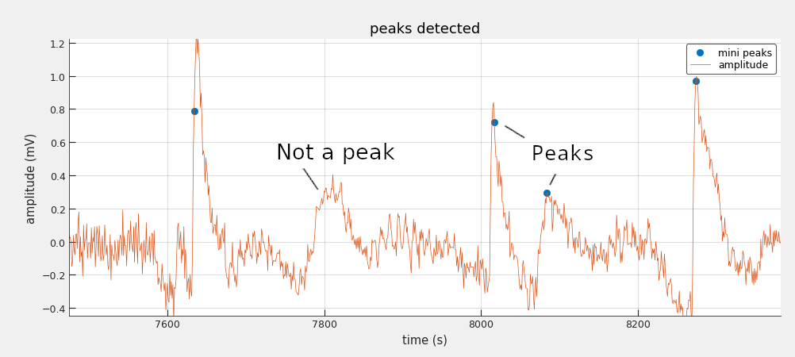
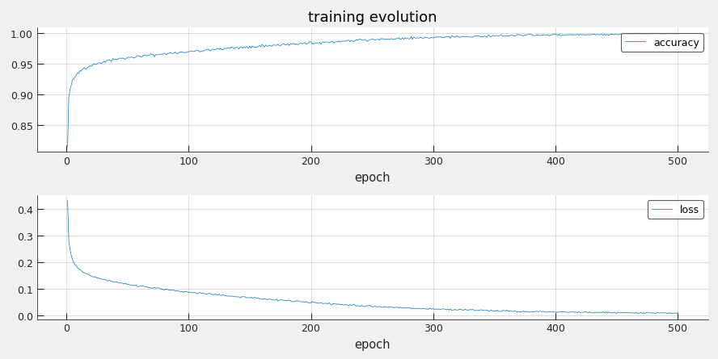

# Minipeak #

A deep learning based method to automatically identify [miniature EPSPs events](https://en.wikipedia.org/wiki/Excitatory_postsynaptic_potential#Miniature_EPSPs_and_quantal_analysis) from electrophysiology data.

The input of the system is an electrophysiology experiment data and the output is the timestamp and amplitude of the miniature EPSPs events (aka mini peaks). As shown in the graph below it is not trivial to design a handcrafted algorithm to identify the mini peaks because the shape of the signal is the defining discriminator (the amplitude of the signal alone is not sufficient). This is why a deep learning approach has been chosen.



The main goal of this toy project is for me to apply what I learnt in the diverse deep learning courses on a real world problem from scratch.

# Installation

## Pytorch

Install pytorch following [the official instructions](https://pytorch.org/get-started/locally/).

## Other dependencies

From the root folder of this repository:

```
pip3 install .
```

# Training the network

## Training data format

Training is done with the script `train_test_model.py` which takes as input a folder containing the training data in csv files.
The csv files must contains a time serie of the electrophysiology data together with the presence or absence of mini peak for each timestep.

Here is the first four lines of a well formatted csv file:

```
time,amplitude,minis
0.1,-0.0909423828125,0.0
0.10200000000000001,-0.09246826171875,0.0
0.10400000000000001,-0.24658203125,0.0
```

- *time* is in second
- *amplitude* is in mV
- *minis* = 0.0 if no mini peak for this timestep; 1.0 if mini peak for this timestep

Please take a look at the `minipeak.data` submodule for an example of how to preprocess the raw electrophysiology data for training.

## Launch the training loop

To train the network, the script `train_test_model.py` is used. Here is an example:

```
python minipeak/training/train_test_model.py example_data/ training_output/ --epochs 1000 --window-size 80
```

See `train_test_model.py` or do `python minipeak/training/train_test_model.py -h` to get the full list of available settings.

The output of the training is the following files structure that will be saved under the *exp_folder* path:

- *exp_folder* - root folder of the training outputs
 - *experiment.json* - hyperparameters used to train the model and the test set validation results (loss, accuracy, precision, recall rate)
 - *model.pt* - the saved weight of the trained model
 - *training_results.csv* - loss and accuracy evolution for each training epoch
 - *correct_positives* - folder containing plots of all correctly detected mini peaks during test time
 - *false_negatives* - folder containing plots of all mini peaks that don't have been detected during test time
 - *false_positives* - folder containing plots of all wrongly detected mini peaks during test time

# Inference

The inference just take the raw electrophysiology data in [Axon Binary Format (ABF) file](https://www.moleculardevices.com/sites/default/files/en/assets/user-guide/dd/cns/axon-binary-file-format-v2-0-9.pdf).

```
python minipeak/training/eval_model.py example_data/example_inference_data.abf minipeak/weights/model.pt --sampling_rate 100 --remove_trend_win_ms 100 --window-size 80
```

See `eval_model.py` or do `python minipeak/training/eval_model.py -h` to get the full list of available settings.

The output of the script is a csv file containing the list of detected mini peaks with timestamp (in seconds) and amplitude (in mV) for each mini peak.

# Code structure

- `minipeak`   - the python package of the project
 - `data`     - utility to extract relevant experiemental lab data for training.
 - `models`   - the neural network models
 - `styles`   - matplotlib styles configuration
 - `training` - the training and test loops script and the inference script
 - `visualization` - scripts to visualize the data and results
 - `weights`  - contains the trained weight files

# Method

TODO explain and pinpoint relevant code:
- 1D CNN choice and archi
- overlapping windows
- improve with transformer

# Results

## Training evolution



## Performance achieved

Test set results:
- *accuracy* = 0.9430
- *precision* = 0.9102
- *recall* = 0.9128
-  *mini peak position mean error within widow* <1ms
